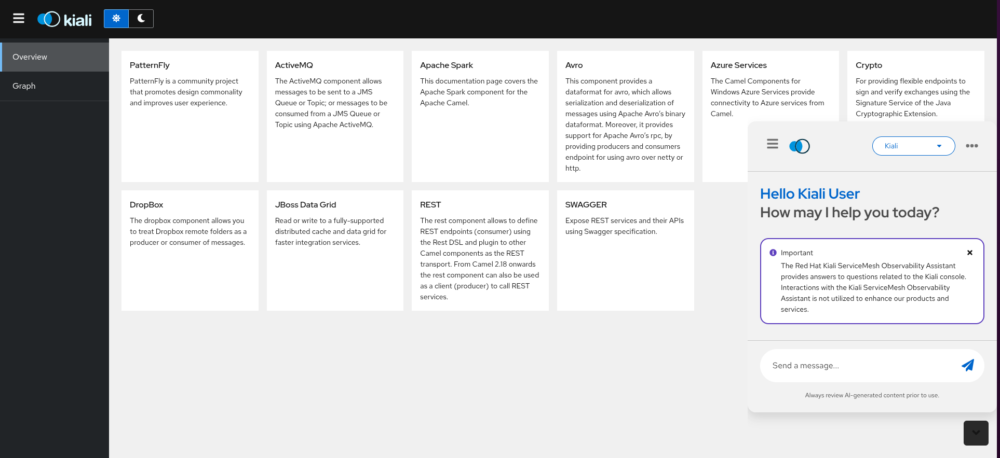
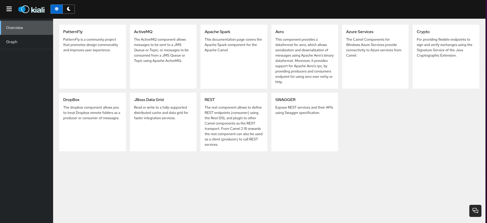
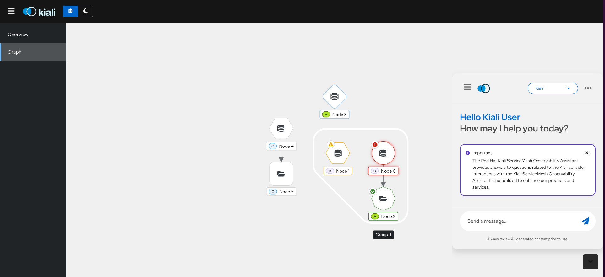
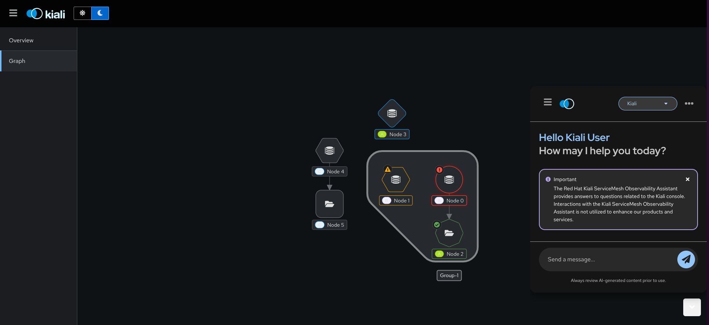

# Kiali Chatbot – Dev App

This `dev/` app is a lightweight PatternFly 5 mock-up of Kiali used to develop and manually test the `@kiali/chatbot` package locally.

## Quick start

```bash
# from the repository root
cd dev
yarn install
yarn start
```

This launches the demo at `http://localhost:3000`.

## What this demo contains

- `src/KialiMockUp/`: a small PF5 mock-up of Kiali (header, sidebar, Overview and Graph pages, light/dark switch).
- `src/Chatbot.tsx` and `src/ChatbotWindow.tsx`: usage examples of the `@kiali/chatbot` library, embedded into the mock-up.
- The demo depends on the library from the repo root via a workspace link (`@kiali/chatbot: link:../`). Build the root package when you change the library to see updates reflected here.

## PF6 library with PF5 app (compat note)

The main Kiali project can embed the PF6-based `@kiali/chatbot` inside its PF5 UI as long as it provides files analogous to this demo’s `Chatbot.tsx` and `ChatbotWindow.tsx`. These files act as the integration points and should be kept similar in structure so styles and behavior remain compatible.

## Screenshots

Overview with chatbot:



Overview:



Graph:



Graph (dark mode):




